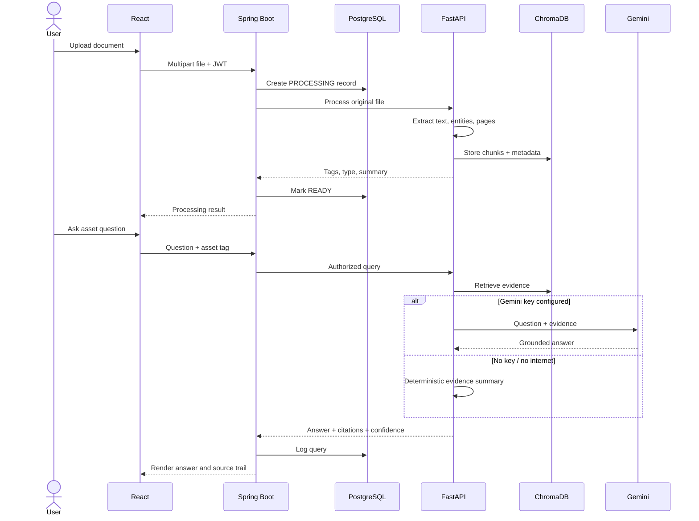

# Document and Question Data Flow

```mermaid
sequenceDiagram
    actor User
    participant UI as React
    participant API as Spring Boot
    participant DB as PostgreSQL
    participant AI as FastAPI
    participant V as ChromaDB
    participant LLM as Gemini

    User->>UI: Upload document
    UI->>API: Multipart file + JWT
    API->>DB: Create PROCESSING record
    API->>AI: Process original file
    AI->>AI: Extract text, entities, pages
    AI->>V: Store chunks + metadata
    AI-->>API: Tags, type, summary
    API->>DB: Mark READY
    API-->>UI: Processing result

    User->>UI: Ask asset question
    UI->>API: Question + asset tag
    API->>AI: Authorized query
    AI->>V: Retrieve evidence
    alt Gemini key configured
        AI->>LLM: Question + evidence
        LLM-->>AI: Grounded answer
    else No key / no internet
        AI->>AI: Deterministic evidence summary
    end
    AI-->>API: Answer + citations + confidence
    API->>DB: Log query
    API-->>UI: Render answer and source trail
```

