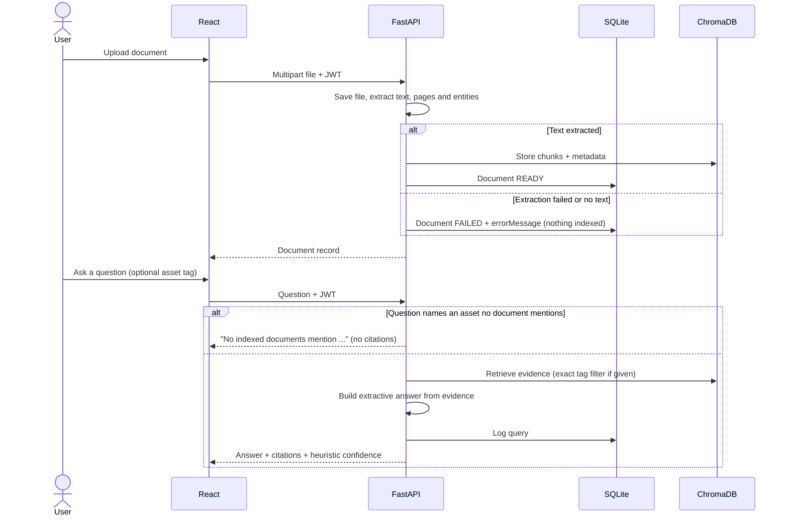

# Document and Question Data Flow (current)

```mermaid
sequenceDiagram
    actor User
    participant UI as React
    participant API as FastAPI
    participant DB as SQLite
    participant V as ChromaDB

    User->>UI: Upload document
    UI->>API: Multipart file + JWT
    API->>API: Save file, extract text, pages and entities
    alt Text extracted
        API->>V: Store chunks + metadata
        API->>DB: Document READY
    else Extraction failed or no text
        API->>DB: Document FAILED + errorMessage (nothing indexed)
    end
    API-->>UI: Document record

    User->>UI: Ask a question (optional asset tag)
    UI->>API: Question + JWT
    alt Question names an asset no document mentions
        API-->>UI: "No indexed documents mention ..." (no citations)
    else
        API->>V: Retrieve evidence (exact tag filter if given)
        API->>API: Build extractive answer from evidence
        API->>DB: Log query
        API-->>UI: Answer + citations + heuristic confidence
    end
```
