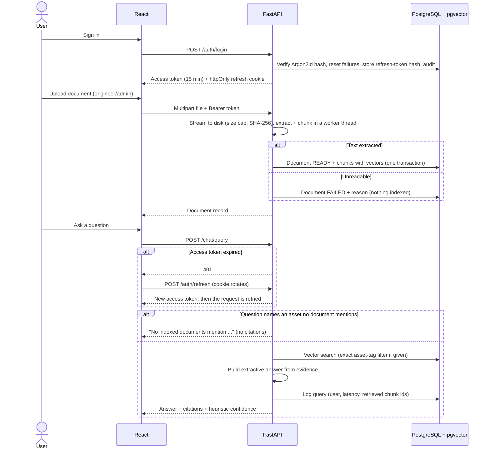

# Request and Data Flow (current: after Phase 1)

```mermaid
sequenceDiagram
    actor User
    participant UI as React
    participant API as FastAPI
    participant DB as PostgreSQL + pgvector

    User->>UI: Sign in
    UI->>API: POST /auth/login
    API->>DB: Verify Argon2id hash, reset failures, store refresh-token hash, audit
    API-->>UI: Access token (15 min) + httpOnly refresh cookie

    User->>UI: Upload document (engineer/admin)
    UI->>API: Multipart file + Bearer token
    API->>API: Stream to disk (size cap, SHA-256), extract + chunk in a worker thread
    alt Text extracted
        API->>DB: Document READY + chunks with vectors (one transaction)
    else Unreadable
        API->>DB: Document FAILED + reason (nothing indexed)
    end
    API-->>UI: Document record

    User->>UI: Ask a question
    UI->>API: POST /chat/query
    alt Access token expired
        API-->>UI: 401
        UI->>API: POST /auth/refresh (cookie rotates)
        API-->>UI: New access token, then the request is retried
    end
    alt Question names an asset no document mentions
        API-->>UI: "No indexed documents mention ..." (no citations)
    else
        API->>DB: Vector search (exact asset-tag filter if given)
        API->>API: Build extractive answer from evidence
        API->>DB: Log query (user, latency, retrieved chunk ids)
        API-->>UI: Answer + citations + heuristic confidence
    end
```
