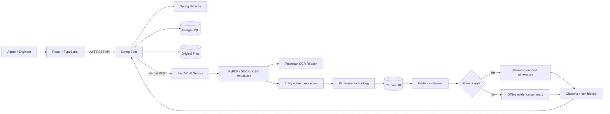

# IndusMind AI System Architecture

## Responsibility boundaries

- React presents workflows but never calls the AI service directly.
- Spring Boot is the system of record and security boundary.
- PostgreSQL stores users, document metadata, and query logs.
- FastAPI owns document intelligence, retrieval, citations, and RCA support.
- ChromaDB runs in embedded persistent mode, avoiding another server.
- Gemini is optional; evidence retrieval and deterministic summaries work offline.

